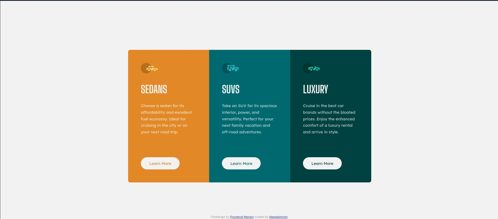
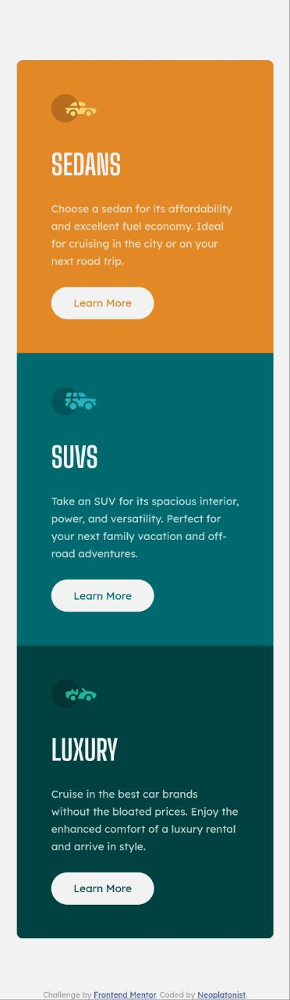

# Frontend Mentor - 3-column preview card component solution

This is a solution to the [3-column preview card component challenge on Frontend Mentor](https://www.frontendmentor.io/challenges/3column-preview-card-component-pH92eAR2-). Frontend Mentor challenges help you improve your coding skills by building realistic projects.

## Table of contents

- [Overview](#overview)
  - [The challenge](#the-challenge)
  - [Screenshot](#screenshot)
  - [Links](#links)
- [My process](#my-process)
  - [Built with](#built-with)
  - [What I learned](#what-i-learned)
  - [Continued development](#continued-development)
  - [Useful resources](#useful-resources)
- [Author](#author)
- [Acknowledgments](#acknowledgments)

**Note: Delete this note and update the table of contents based on what sections you keep.**

## Overview

### The challenge

Users should be able to:

- View the optimal layout depending on their device's screen size ( Mobile and Desktop )
- See hover states for interactive elements

### Screenshot

#### Desktop View

#### Mobile View

### Links

- Solution URL: [GitHub](https://github.com/Neoplatonist/3-column-preview-card-component)
- Live Site URL: [Github Pages](https://neoplatonist.github.io/3-column-preview-card-component/)

## My process

As part of my development process, I utilize a dual-tabbed web browser window to compare my live environment with a provided image. By enabling web tools for both tabs and setting the mode to mobile development with a target mobile width, I am able to achieve a tracing paper-like experience for achieving near-perfect code-to-image matching. Once the mobile development is complete, I scale the live environment upwards to identify any breakpoints and address any issues that arise until the targeted desktop dimensions are achieved.

### Built with

- Semantic HTML5 markup
- CSS custom properties
- Flexbox
- Mobile-first workflow
- Google Fonts
- Buttons have an Active State

### What I learned

I have gained valuable insight into the versatility of FlexBox, which allows for seamless switching of content flow direction between columns and rows based on the display port size.

### Continued development

In order to further develop this project, I would consider utilizing a JavaScript framework such as Svelte or Astro. By doing so, I could break down the `<article />` elements into reusable components that would become static content at build time. Additionally, I would aim to standardize the CSS measurements, as opposed to using numerous exact decimal style measurements. This would enable more efficient calculations for the margin, border, and padding properties.

## Author

- Website - [Joshua F. Johnston](https://github.com/Neoplatonist)
- Frontend Mentor - [@neoplatonist](https://www.frontendmentor.io/profile/neoplatonist)
